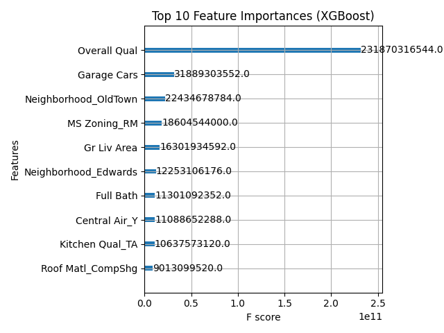

# 🏠 House Price Prediction (Ames Housing Dataset)

This project predicts house prices using the Ames Housing dataset, applying multiple regression models including Linear Regression, Random Forest, and XGBoost.

## 📊 Models and Results

| Model              | R² Score | MAE         |
|--------------------|----------|-------------|
| Linear Regression  | 0.8952   | 16247.95    |
| Random Forest      | 0.9110   | 15701.46    |
| XGBoost            | 0.9100   | 16028.78    |

## 🔧 Technologies
- Python, Pandas, NumPy
- Scikit-Learn, XGBoost
- Matplotlib, Seaborn
- Jupyter Notebook

## 📁 Repository Structure

## 📈 Feature Importance (from XGBoost)

The model found features like Lot Area, Lot Frontage, and Gr Live Area to be highly influential in price prediction.

