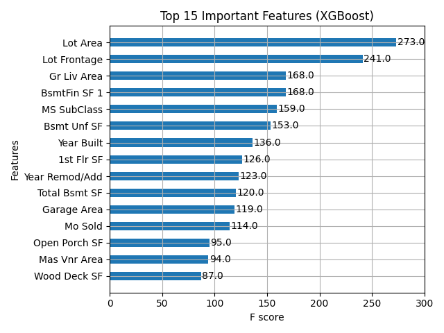

# 🏠 House Price Prediction (Ames Housing Dataset)

This project predicts house prices using the Ames Housing dataset, applying multiple regression models including Linear Regression, Random Forest, and XGBoost.

## 📊 Dataset
- **Source:** [Kaggle](https://www.kaggle.com/datasets/prevek18/ames-housing-dataset)
- **Size:** ~80 features, 2900+ observations
- **Target variable:** SalePrice (USD)

## 🚀 Steps
1. Data cleaning and preprocessing
2. Exploratory Data Analysis (EDA)
3. Feature selection and engineering
4. Model building (Linear Regression, Random Forest, XGBoost)
5. Evaluation (MSE, MAE, R²)
6. Finding Top Important Features

## 📊 Models and Results

| Model              | R² Score | MAE         |
|--------------------|----------|-------------|
| Linear Regression  | 0.8952   | 16247.95    |
| Random Forest      | 0.9110   | 15701.46    |
| XGBoost            | 0.9100   | 16028.78    |

## 🔧 Technologies
- Python, Pandas, NumPy
- Scikit-Learn, XGBoost
- Matplotlib, Seaborn
- Jupyter Notebook

## 📁 Repository Structure
house-price-prediction/
├── data/                   # Folder to store the dataset
│   └── AmesHousing.csv     # dataset in csv format
├── notebooks/              # Jupyter notebooks for EDA and modeling
│   └── house-price.ipynb   # Notebook for data exploration, training and evaluating models
├── outputs/                # Output files such as plots or model files
│   └── feature_importance.png  # Feature importance plot from XGBoost
├── README.md               # Project documentation
├── requirements.txt        # List of Python packages used

## 📈 Feature Importance (from XGBoost)

The model found features like Lot Area, Lot Frontage, and Gr Live Area to be highly influential in price prediction.

## 🧠 Author
👩‍💻 Mozhdeh Talebian  
📍 Biomedical Engineering background + Data Science Enthusiast
